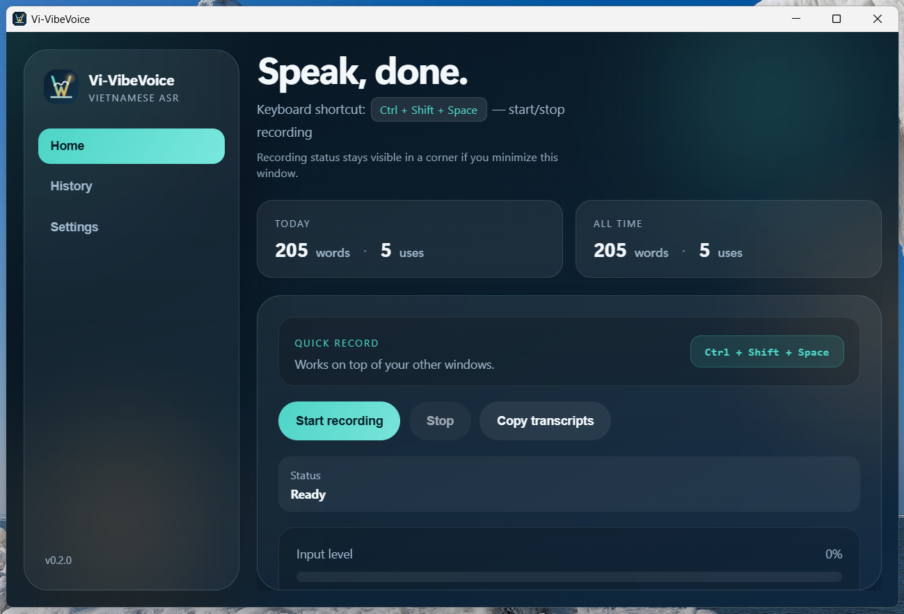
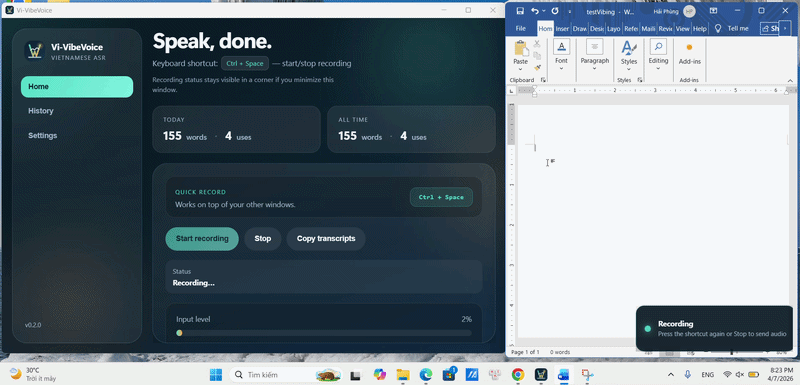

# 🎙️ Vi-VibeVoice

<p align="center">
  <b>Fast • Accurate • Vietnamese Speech-to-Text for Everyday Use</b><br/>
  Speak naturally. Get text instantly. No friction.
</p>


<p align="center">
  <a href="#"></a>
  <a href="#"></a>
  <a href="#"></a>
  <a href="#"></a>
</p>

<p align="center">
  
</p>

---

## 🎬 Demo

<p align="center">
  
</p>

<p align="center">
  <i>Real-time Vietnamese speech-to-text with low latency and high accuracy</i>
</p>


---

## 📌 Table of Contents

- [Overview](#-overview)
- [Why Vi-VibeVoice](#-why-vi-vibevoice)
- [Key Features](#-key-features)
- [System Architecture](#-system-architecture)
- [ASR Modes](#-asr-modes)
- [Quick Start](#-quick-start)
- [Run from Source](#-run-from-source)
- [Models](#-models)
- [Use Cases](#-use-cases)
- [Repository Structure](#-repository-structure)
- [Inspiration](#-inspiration)
- [License](#-license)

---

## 🚀 Overview

**Vi-VibeVoice** is a lightweight desktop application that enables **real-time Vietnamese speech-to-text**, designed for:

- High **accuracy**
- Low **latency**
- Easy **integration with any application**

Unlike traditional solutions, this project focuses on **practical usability**:

- No plugin required  
- No complex setup  
- Works with any text input field  

---

## 🎯 Why Vi-VibeVoice

Vietnamese speech recognition systems often face two main limitations:

### 1. Accuracy issues
- Missing punctuation  
- Incorrect casing  
- Weak normalization (dates, numbers, entities)

### 2. Performance limitations
- High latency  
- Difficult deployment  

---

### ✅ This project addresses both:

- Hybrid **ASR + post-processing (CAPU)** pipeline  
- **Configurable backend** (local or GPU server)  
- Optimized for **real-time usage**

---

## ✨ Key Features

- 🎙️ Global shortcut → speak → text instantly  
- ⚡ Low-latency inference (local or remote)  
- 🔌 Flexible HTTP API backend  
- 🇻🇳 Optimized for Vietnamese language  
- 🧩 Works with **any application**  
- 🪶 Lightweight desktop client  
- 🛠 Fully customizable ASR pipeline  

---

## 🧩 System Architecture

```text
[User Voice]
      ↓
[Desktop App (Electron)]
      ↓
[HTTP API]
      ↓
[ASR Model]
      ↓
[Post-processing (CAPU)]
      ↓
[Final Text → Any App]
````

---

## ⚙️ ASR Modes

| Mode                  | Description            | Hardware        |
| --------------------- | ---------------------- | --------------- |
| Minimal Local ASR     | Simple setup           | CPU             |
| Full API (ASR + CAPU) | High accuracy pipeline | GPU recommended |

---

## ⚡ Quick Start

### 1. Download Installer

👉 **[Download Vi-VibeVoice (Windows)](https://github.com/haipn91/Vi-VibeVoice/releases/Vi-VibeVoice-0.2.1-slim-Setup.exe)**


---

### 2. Install

- Run the `.exe` installer  
- Launch the application after installation  

---

### 3. Setup ASR Backend (Required)

Before using the app, you need to run an ASR server.

#### 🔹 Option A — Minimal Local ASR (CPU)

```bash
python -m venv .venv
pip install -r python/requirements-local-asr.txt
python python/local_asr_server.py --port 18765
```


#### 🔹 Option B — Full ASR + CAPU API (Recommended)

```bash
pip install -r python/requirements-asr-capu-api.txt
python python/asr_capu_api_server.py --port 8000
```


### 4. Configure ASR API
- Open Settings
- Set your ASR API URL

Examples:

- Minimal local:
http://127.0.0.1:18765/asr/transcribe

- Full API:
http://127.0.0.1:8000/asr/transcribe

### 5. Start Using
- Press the global shortcut 🎙️
- Speak → text appears instantly in your active application


## 🛠 Run from Source

### Client

```bash
git clone https://github.com/haipn91/Vi-VibeVoice.git
cd Vi-VibeVoice
npm install
npm start
```

### Minimal ASR Server

```bash
python -m venv .venv
pip install -r python/requirements-local-asr.txt
python python/local_asr_server.py --port 18765
```

### Full ASR + CAPU API

```bash
pip install -r python/requirements-asr-capu-api.txt
python python/asr_capu_api_server.py --port 8000
```

---

## 🧠 Models

| Component       | Model              | Purpose                     |
| --------------- | ------------------ | --------------------------- |
| ASR             | gipformer-65M-rnnt | Speech recognition          |
| Post-processing | xlm-roberta-capu   | Punctuation & normalization |


---

## 💡 Use Cases

* Voice typing for documents
* Chatbot interaction without keyboard
* Meeting transcription (real-time notes)
* Enterprise data entry systems
* Integration with AI assistants

---

## 📁 Repository Structure

| Folder      | Description      |
| ----------- | ---------------- |
| `electron/` | Desktop app core |
| `src/`      | UI components    |
| `python/`   | ASR backend      |
| `examples/` | Model demos      |
| `docs/`     | Documentation    |
| `releases/` | Installer        |

---

## 🤝 Inspiration

* Microsoft VibeVoice
* Handy

This project adapts similar ideas with a focus on:

* Vietnamese language
* Open architecture
* Practical deployment


---

## 📄 License

MIT License © Vi-VibeVoice contributors